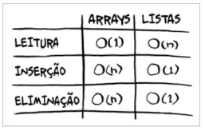

# 💻 Entendendo Algoritmos

Implementações básicas em JavaScript realizadas a partir do livro Entendendo Algoritmos de Aditya Y. Bhargava.

## 🚀 Tecnologias

- JavaScript
- NodeJs

## 📖 Referências

- [Livro Entendendo Algoritmos de Aditya Y. Bhargava](https://amzn.to/4hXXllM)
- [Repositório oficial do livro](https://github.com/egonschiele/grokking_algorithms?tab=readme-ov-file)

## 🗺 Índice

### 1 Introdução a algoritmos

- Pesquisa simples (On)
- Pesquisa binária (On log n)
- Notação Big O

### 2 Ordenação por seleção

- Array
- Lista ligada - Linked List
  - Simplesmente ligada
  - Duplamente ligada

- Selection sort ( On² )

### 3 Recursão

- Recursão
- Pilha
  - Push
  - Pop
  - Pilha de chamada recursiva

### 4 Quicksort

- Dividir para conquistar
- Somar elementos do array
  - Loop O(n)
  - Recursão O(log n)
- Quicksort
  - Pior caso: Pegando o primeiro elemento como pivô O(n²)
  - Caso médio: Pegando elemento aleatório como pivô O(n log n)
  - Melhor caso: Pegando elemento central como pivô - Método partition O(n log n)

### 5 Tabelas hash

### 6 Pesquisa em largura (Teoria dos grafos)

- Um modelo de grafo é um conjunto de conexões
- Vértices
- Arestas
- Problema do caminho mínimo
- Pesquisa em largura O(v+a)
  - Existe algum caminho do vértice A até o B?
  - Qual o caminho mínimo do vértice A até o B?
  - Filas (First In, First Out)
    - Enqueue (Enfileirar) 
    - Dequeue (Desenfileirar)
- Transformer

### 7 Algoritmo de Dijkstra

### 8 Algoritmos gulosos

### 9 Programação dinâmica
